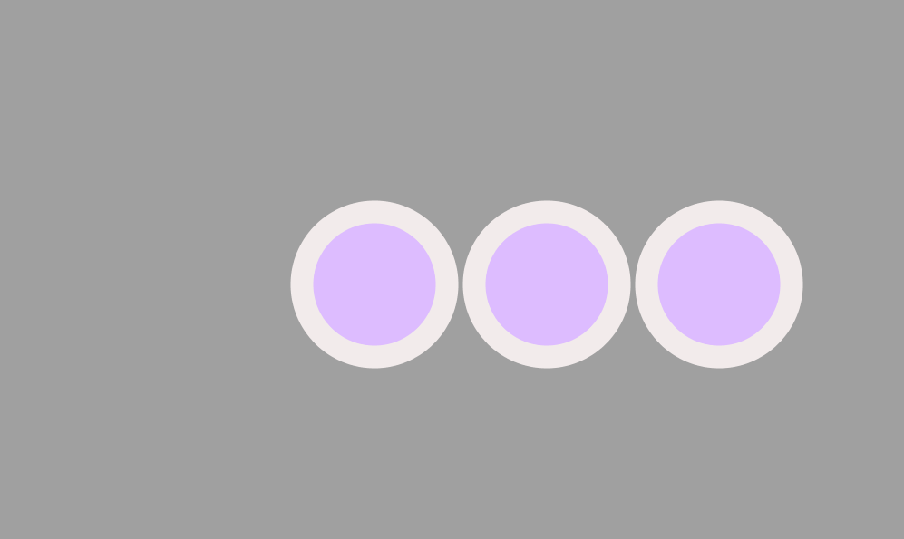
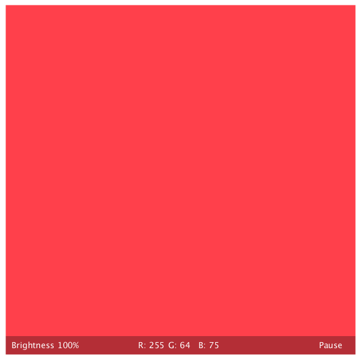
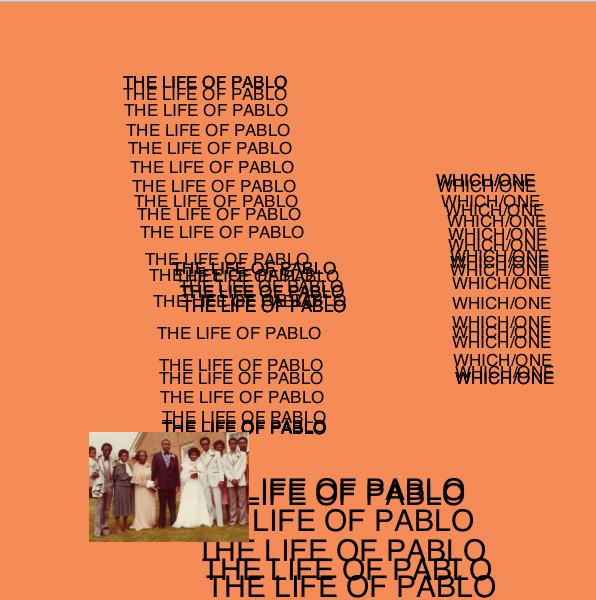

# Three processing sketches

## Nr.1: Ellipse Zoom  
  
[Code](sketch_ellipseZoom/ellipseZoom.pde)   
  
  
Change mouse position to change the grid. Click or press left mouse to zoom in.  
  
## Nr.2: Color Picker  
  
[Code](sketch_colorPicker/colorPicker.pde)  

  
**Look for the right color in an intuitive way.**  
  
Change mouse x and y position to change color. Click left to increase brightness. Click right to decrease brightness. Press space to get the current colors RGB and brightness values.

## Nr.3: The Life of Pablo Cover Generator  
  
[Code](sketch_lifeOfPablo/sketch_lifeOfPablo.pde)  

  
**Create your own version of Kanye West's The Life of Pablo album cover.**    

press mouse to draw text  
press space to change text  
arrow key up: big text size  
arrow key down: small text size    
any other key: reset  

